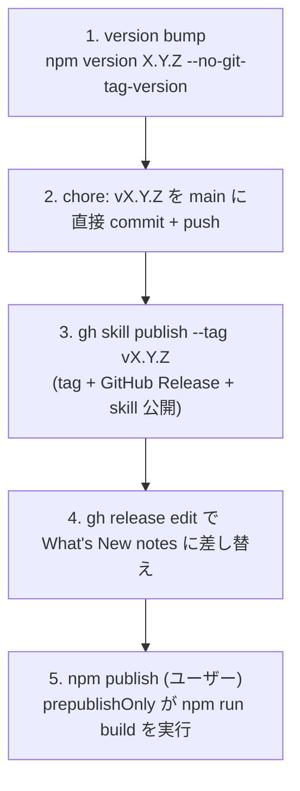

# 開発ガイド

[](https://mkdn.review/?url=https%3A%2F%2Fraw.githubusercontent.com%2Foubakiou%2Fmd2idx%2Frefs%2Fheads%2Fmain%2Fdocs%2Fdesign%2Fdevelopment.md)

## 前提条件

- Node.js >= 24.0.0
- npm

## セットアップ

```sh
bash local_setup.sh
```

## コマンド

| コマンド          | 説明                               |
| ----------------- | ---------------------------------- |
| `vp test`         | テスト実行（vitest）               |
| `vp pack --dts`   | ビルド（`dist/md2idx.mjs` 生成）   |
| `vp check`        | lint / fmt / type チェック一括実行 |
| `vp check --fix`  | 自動修正付きチェック               |
| `vp test --watch` | テストのウォッチモード             |

## テスト

vitest の in-source testing を採用している。テストは `src/md2idx.ts` 末尾の `if (import.meta.vitest)` ブロックに記述する。ビルド時には `import.meta.vitest` が `undefined` に置換され、テストコードは除去される。

## ビルド

`vp pack` で `src/md2idx.ts` を単一ファイル `dist/md2idx.mjs` にバンドルする。外部ランタイム依存はない。

## リリースプロセス

npm パッケージ `md2idx` / GitHub Releases / `gh skill` レジストリの 3 つに対して **同一バージョンタグで成果物を公開する**手順。手順の正典は「全体フロー」とし、以降の小節はその各ステップの WHY を補足する。

### 公開先は 3 つ、タグは 1 つ

1 リリースで成果物が向かう先は 3 系統あり、すべて **同一の `vX.Y.Z` git tag に紐づく**。

| 公開先                | 配布物                                    | 公開コマンド                    | この環境からの実行可否             |
| --------------------- | ----------------------------------------- | ------------------------------- | ---------------------------------- |
| npm registry          | CLI 本体 `md2idx`（`npx` 起動元）         | `npm publish`                   | 不可（npm 未認証、ユーザーが実行） |
| GitHub Releases       | リリースノート（What's New）              | `gh skill publish` が兼ねる     | 可                                 |
| `gh skill` レジストリ | `md2idx-read` skill（`gh skill install`） | `gh skill publish --tag vX.Y.Z` | 可                                 |

WHY タグを共有するか: **バージョン番号を 1 つの真実とし、3 公開先の対応関係を機械的に決める**ため。利用者は `gh skill install ... --pin vX.Y.Z` と `npm view md2idx@X.Y.Z` が同じソースを指すことを前提にできる。

WHY `gh skill publish` が GitHub Release を兼ねるか: `gh skill publish` はローカルの `skills/*/SKILL.md` を agentskills.io 仕様で検証したうえで **GitHub Release を作成してタグを切る**実装になっている。したがって skill 公開と GitHub Release は別コマンドではなく 1 コマンドに統合される。リリースノートは publish が生成する auto notes を後から差し替える。

### 全体フロー



#### 1. version bump

```bash
npm version 0.1.1 --no-git-tag-version
```

`package.json` と `package-lock.json` の version を書き換える。WHY `--no-git-tag-version`: 既定の `npm version` は commit とタグ生成まで行うが、本リポジトリは commit メッセージを `chore: vX.Y.Z` に揃え、タグ生成は後段の `gh skill publish` に一元化したいため、bump だけに留める。bump 後は diff が version 行のみであることを確認する。

#### 2. main に直接 commit + push

```bash
git commit -m "chore: v0.1.1"
git push origin main
```

WHY ブランチ + PR ではなく main 直接: version bump のみの chore commit であり、レビュー対象となる機能変更を含まないため。

#### 3. gh skill publish でタグ + Release + skill 公開

```bash
gh skill publish --dry-run        # 先に検証（skill 名 / frontmatter / install metadata）
gh skill publish --tag v0.1.1     # tag を push 済み main HEAD に切り、Release を作成
```

`--tag` を渡すと対話なしで publish する。タグは push 済みの main HEAD（= `chore` commit）に切られるため、**手順 2 の push を先に完了しておくこと**が前提。`agent-skills` topic は publish 時に必要だが既に付与済み。`no active tag protection rulesets found` 警告は tag 保護未設定の通知で、publish 自体は成功する。

WHY dry-run を先に: `skills/md2idx-read/SKILL.md` の `name` がディレクトリ名と一致するか、`metadata.github-*` の install metadata が混入していないか等を、Release を作る前に検証するため。混入時は `--fix` で除去できる。

#### 4. リリースノートを What's New 形式に差し替え

```bash
gh release edit v0.1.1 --notes-file <notes.md>
```

publish が付ける auto notes（`Full Changelog` リンクのみ）を **What's New 形式**（利用者から見える変更に絞った箇条書き + Full Changelog 行）に置き換える。ノート本文は `git log vPREV..HEAD` のうち利用者から見える変更に絞り、docs / refactoring / 内部 commit は省く。

#### 5. npm publish（ユーザーが実行）

```bash
npm whoami     # 認証確認（この環境は未認証）
npm publish    # prepublishOnly が npm run build を実行してから公開
```

WHY この環境から実行しないか: devcontainer は npm registry に未認証（`npm whoami` が 401）。`npm publish` は publish 直前に `prepublishOnly`（= `npm run build`）が走り、`dist/md2idx.mjs` + `dist/md2idx.d.mts` を生成してから公開する。公開後 `npm view md2idx version` で反映を確認する。

### リリースチェックリスト

- [ ] `npm version X.Y.Z --no-git-tag-version` の diff が version 行のみ
- [ ] `chore: vX.Y.Z` を main に commit + push 済み
- [ ] `gh skill publish --dry-run` がエラーなし
- [ ] `gh skill publish --tag vX.Y.Z` 後、tag が `chore` commit を指す（`git ls-remote --tags origin vX.Y.Z`）
- [ ] `gh release edit` で What's New ノートに差し替え済み
- [ ] （ユーザー）`npm publish` 後、`npm view md2idx version` が新バージョン
