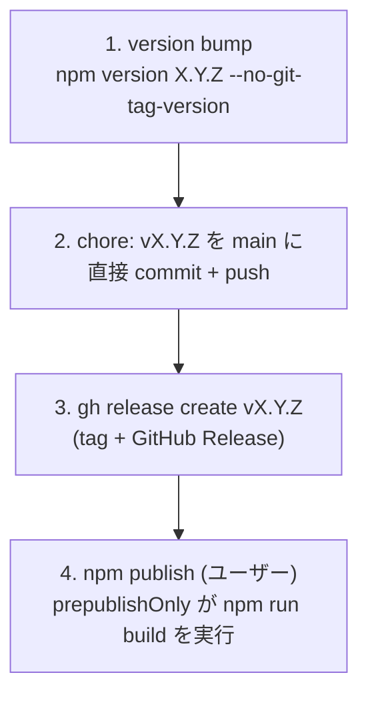

# 開発ガイド

[](https://mkdn.review/?url=https%3A%2F%2Fraw.githubusercontent.com%2Foubakiou%2Fmd2idx%2Frefs%2Fheads%2Fmain%2Fdocs%2Fdesign%2Fdevelopment.md)

## 前提条件

- Node.js >= 24.0.0
- npm

## セットアップ

```sh
npm install
```

## コマンド

| コマンド              | 説明                               |
| --------------------- | ---------------------------------- |
| `npm test`            | テスト実行（vitest）               |
| `npm run build`       | ビルド（`dist/md2idx.mjs` 生成）   |
| `npx vp check`        | lint / fmt / type チェック一括実行 |
| `npx vp check --fix`  | 自動修正付きチェック               |
| `npx vp test --watch` | テストのウォッチモード             |

## プロジェクト構成

```
src/md2idx.ts    ソースコード（パーサ + コアロジック + CLI + インラインテスト）
dist/md2idx.mjs  ビルド成果物（CLI バイナリ）
docs/design/     設計ドキュメント
```

## テスト

vitest の in-source testing を採用している。テストは `src/md2idx.ts` 末尾の `if (import.meta.vitest)` ブロックに記述する。ビルド時には `import.meta.vitest` が `undefined` に置換され、テストコードは除去される。

## ビルド

`vp pack` で `src/md2idx.ts` を単一ファイル `dist/md2idx.mjs` にバンドルする。外部ランタイム依存はない。

## リリースプロセス

npm パッケージ `md2idx` と GitHub Releases の 2 つに対して **同一バージョンタグで成果物を公開する**手順。手順の正典は「全体フロー」とし、以降の小節はその各ステップの WHY を補足する。

### 公開先は 2 つ、タグは 1 つ

| 公開先          | 配布物                            | 公開コマンド        | この環境からの実行可否             |
| --------------- | --------------------------------- | ------------------- | ---------------------------------- |
| npm registry    | CLI 本体 `md2idx`（`npx` 起動元） | `npm publish`       | 不可（npm 未認証、ユーザーが実行） |
| GitHub Releases | リリースノート（What's New）      | `gh release create` | 可                                 |

### 全体フロー



#### 1. version bump

```bash
npm version 0.1.1 --no-git-tag-version
```

`package.json` と `package-lock.json` の version を書き換える。WHY `--no-git-tag-version`: 既定の `npm version` は commit とタグ生成まで行うが、本リポジトリは commit メッセージを `chore: vX.Y.Z` に揃え、タグ生成は後段の `gh release create` に一元化したいため、bump だけに留める。bump 後は diff が version 行のみであることを確認する。

#### 2. main に直接 commit + push

```bash
git commit -m "chore: v0.1.1"
git push origin main
```

WHY ブランチ + PR ではなく main 直接: version bump のみの chore commit であり、レビュー対象となる機能変更を含まないため。

#### 3. gh release create でタグ + Release

```bash
gh release create v0.1.1 --target main --generate-notes
```

タグは push 済みの main HEAD（= `chore` commit）に切られるため、**手順 2 の push を先に完了しておくこと**が前提。`--generate-notes` で自動生成されたノートを基に、必要に応じて `gh release edit` で **What's New 形式**（利用者から見える変更に絞った箇条書き + Full Changelog 行）に差し替える。

#### 4. npm publish（ユーザーが実行）

```bash
npm whoami     # 認証確認（この環境は未認証）
npm publish    # prepublishOnly が npm run build を実行してから公開
```

WHY この環境から実行しないか: devcontainer は npm registry に未認証（`npm whoami` が 401）。`npm publish` は publish 直前に `prepublishOnly`（= `npm run build`）が走り、`dist/md2idx.mjs` + `dist/md2idx.d.mts` を生成してから公開する。公開後 `npm view md2idx version` で反映を確認する。

### リリースチェックリスト

- [ ] `npm version X.Y.Z --no-git-tag-version` の diff が version 行のみ
- [ ] `chore: vX.Y.Z` を main に commit + push 済み
- [ ] `gh release create vX.Y.Z` 後、tag が `chore` commit を指す（`git ls-remote --tags origin vX.Y.Z`）
- [ ] （ユーザー）`npm publish` 後、`npm view md2idx version` が新バージョン
