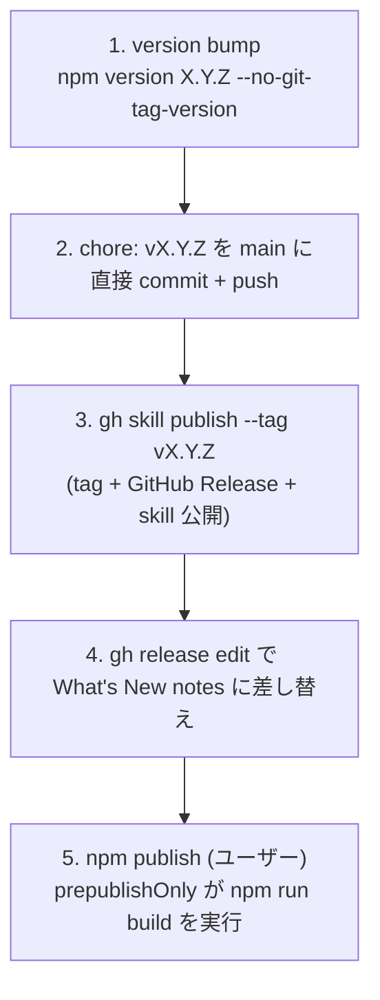

# 開発ガイド

[](https://mkdn.review/?url=https%3A%2F%2Fraw.githubusercontent.com%2Foubakiou%2Fmd2idx%2Frefs%2Fheads%2Fmain%2Fdocs%2Fdesign%2Fdevelopment.md)

## 前提条件

- Node.js >= 24.0.0
- npm

## セットアップ

```sh
bash local_setup.sh
```

## コンテナディスクの掃除

VS Code server / npm / agent のキャッシュはコンテナディスク上で再蓄積し、放置すると ENOSPC で Bash ツールを含む全書き込みが停止する。`scripts/clean-devcontainer-disk.sh` が固定 allowlist 内の再生成可能キャッシュだけを冪等に回収する。

| コマンド                                                 | 用途                                                                  |
| -------------------------------------------------------- | --------------------------------------------------------------------- |
| `bash scripts/clean-devcontainer-disk.sh --dry-run`      | 削除せず候補・skip 理由・回収見込みだけを表示する                     |
| `bash scripts/clean-devcontainer-disk.sh`                | 閾値を見ずに無条件で回収する（手動実行）                              |
| `bash scripts/clean-devcontainer-disk.sh --threshold 90` | 使用率 90% 以上、または空き容量が既定下限 5GiB 未満のときだけ回収する |
| `npm test -- scripts/clean-devcontainer-disk.test.ts`    | 契約テスト                                                            |

`local_setup.sh`（初回）と `postStartCommand`（毎起動）は `--threshold 90` で呼ぶ。掃除の非 0 終了と script 不在は警告に変換され、setup と container 起動をブロックしない。終了コードは 0 が正常系（no-op / safety skip を含む）、1 が operational failure、2 が引数エラー。

対象は `~/.vscode-server/extensionsCache`、`~/.npm/_cacache`、`~/.codex/.tmp`、および共有 mount でないと証明できる場合の `/vscode/vscode-server/extensionsCache` に固定されている。削除 root を任意の path へ向ける引数や専用の環境変数はない。

使用中リソースは削除しない。process listing が取得できない場合や、共有 `/vscode` volume 上のように他コンテナの liveness を証明できない場合は、category ごと skip して理由を報告する。`/vscode/vscode-server/bin` の世代は手動確認候補として表示するだけで自動削除しない。

### ENOSPC 時の診断順

1. `df -PhT / <repository>` でコンテナ側（overlay）と repository 側（host mount）を区別する。repository が host mount なら `.temp/` はコンテナディスクを圧迫していない
2. `bash scripts/clean-devcontainer-disk.sh --dry-run` で回収見込みと skip 理由を確認し、必要なら引数なしで実行する
3. 掃除後も閾値を超える場合はスクリプトが警告を出す。手動確認候補（`/vscode/vscode-server/bin` の世代、共有 volume 上の entry）は、その volume を使う全 container の停止を確認したうえで手動で削除する
4. コンテナ側で解消しない場合は host で `docker system df` を実行し、image / container / local volume / build cache の内訳を確認する

## コマンド

| コマンド             | 説明                                                       |
| -------------------- | ---------------------------------------------------------- |
| `npm run check`      | format / lint / type check                                 |
| `npm run check:fix`  | 自動修正付き check                                         |
| `npm test`           | テスト実行（vitest）                                       |
| `npm run build`      | ビルド（`dist/md2idx.mjs` / `dist/cli.mjs` 生成）          |
| `npm run pack:check` | check / test / build / `npm pack --dry-run` をまとめて実行 |
| `npm run test:watch` | テストのウォッチモード                                     |

開発中は小さい変更ごとに `npm run check` と `npm test` を通し、公開 API / package exports / build 出力に触れた場合は `npm run pack:check` まで確認する。

## テスト

vitest の in-source testing を採用している。テストは `src/md2idx.ts` 末尾の `if (import.meta.vitest)` ブロックに記述する。ビルド時には `import.meta.vitest` が `undefined` に置換され、テストコードは除去される。

`src/` の外にある shell script は in-source test を持てないため、`scripts/<name>.test.ts` に独立した契約テストを置く（`scripts/clean-devcontainer-disk.test.ts` が例）。子プロセスで script を起動し、PATH 先頭に置いた fake command で観測値と成否を制御する。fixture は `.temp/` 配下に作り、`onTestFinished` で回収する。子プロセス起動を伴うため `vite.config.ts` の `testTimeout` を 30 秒にしている。

子プロセスを起動できない sandbox では、この種のテストは製品の回帰と区別がつかない形で失敗する。

## ビルド

`vp pack` で `src/md2idx.ts` を単一ファイル `dist/md2idx.mjs` にバンドルする。外部ランタイム依存はない。

## ドキュメントプロセス

`docs/` 配下には 2 種類のドキュメントがある。

1. **永続資料**: `docs/design/` 配下。設計判断、開発手順など、長く参照される情報を書く
2. **寿命付きドキュメント**: `docs/bug/`、`docs/feature/`、`docs/refactoring/` 配下。テンプレートから複製して起票し、完了後に `docs/archive/` へ移す

- バグ: [docs/bug/bug-template.md](../bug/bug-template.md) をコピーし `docs/bug/bug-<topic>.md` として起票する
- 設計・実装プラン: [docs/feature/feature-plan-template.md](../feature/feature-plan-template.md) をコピーし `docs/feature/<topic>.md` として起票する
- リファクタリング: [docs/refactoring/refactoring-plan-template.md](../refactoring/refactoring-plan-template.md) をコピーし `docs/refactoring/<topic>.md` として起票する

完了後は永続情報を `docs/design/` / README へ移し、`docs/archive/<topic>.archive.md` にリネームする。

## エージェント hook

Claude / Codex の hook は、編集後に直接 `vp` や `tsc` を呼ばず、共通 wrapper を呼ぶ。

```text
Claude / Codex
  └─ PostToolUse(Edit|Write)
      └─ .agents/scripts/check-file.sh <file>
          └─ npm run check:fix -- <file>
```

| ファイル                         | 役割                                 |
| -------------------------------- | ------------------------------------ |
| `.agents/scripts/check-file.sh`  | 編集直後の軽量なファイル単位チェック |
| `.agents/scripts/check-all.sh`   | ローカルの総合検証                   |
| `.agents/scripts/self-review.sh` | commit 前のセルフレビュー補助        |

プロジェクト固有の検証を追加する場合は、`.claude/` や `.codex/` ではなく `.agents/scripts/*` を更新する。この構造により、テンプレート更新時に `.claude/` / `.codex/` をそのまま差し替えられる。

## pre-commit hook

`.githooks/pre-commit` は次を実行する。

1. `npm run build`（`dist/` を最新ソースへ同期する）
2. `npm run check:fix`
3. hook がファイルを書き換えた場合は commit を止め、再ステージを促す
4. `npm run check`
5. `npm test`

hook が変更したファイルを自動で `git add` しない。commit 中の index lock と衝突させず、利用者が差分を確認してからステージするため。

## LSP

`CLAUDE.md` は TypeScript の調査・検証に Claude Code の `LSP` tool を使うよう指示している。これを提供するのは project scope の `typescript-lsp` plugin で、有効化は `.claude/settings.json` の `enabledPlugins` に記録されている。clone 後の追加操作は要らない。

## CI

`.github/workflows/ci.yml` が pull request と `main` への push で走る。`.nvmrc` で pin した Node の clean checkout で `npm ci` → `npm run check` → `npm test` → `npm run build` → `npm pack --dry-run` を順に実行する。

pre-commit hook と同じゲートを、ローカル環境に依存しない状態で再実行するのが目的。step を分けているのは、失敗した gate が GitHub の UI 上で特定できるようにするため。

## リリースプロセス

npm パッケージ `md2idx` / GitHub Releases / `gh skill` レジストリの 3 つに対して **同一バージョンタグで成果物を公開する**手順。手順の正典は「全体フロー」とし、以降の小節はその各ステップの WHY を補足する。

### 公開先は 3 つ、タグは 1 つ

1 リリースで成果物が向かう先は 3 系統あり、すべて **同一の `vX.Y.Z` git tag に紐づく**。

| 公開先                | 配布物                                    | 公開コマンド                    | この環境からの実行可否             |
| --------------------- | ----------------------------------------- | ------------------------------- | ---------------------------------- |
| npm registry          | CLI 本体 `md2idx`（`npx` 起動元）         | `npm publish`                   | 不可（npm 未認証、ユーザーが実行） |
| GitHub Releases       | リリースノート（What's New）              | `gh skill publish` が兼ねる     | 可                                 |
| `gh skill` レジストリ | `md2idx-read` skill（`gh skill install`） | `gh skill publish --tag vX.Y.Z` | 可                                 |

WHY タグを共有するか: **バージョン番号を 1 つの真実とし、3 公開先の対応関係を機械的に決める**ため。利用者は `gh skill install ... --pin vX.Y.Z` と `npm view md2idx@X.Y.Z` が同じソースを指すことを前提にできる。

WHY `gh skill publish` が GitHub Release を兼ねるか: `gh skill publish` はローカルの `skills/*/SKILL.md` を agentskills.io 仕様で検証したうえで **GitHub Release を作成してタグを切る**実装になっている。したがって skill 公開と GitHub Release は別コマンドではなく 1 コマンドに統合される。リリースノートは publish が生成する auto notes を後から差し替える。

### 全体フロー


```mermaid
flowchart TD
    A["1. version bump<br/>npm version X.Y.Z --no-git-tag-version"] --> B["2. chore: vX.Y.Z を main に直接 commit + push"]
    B --> C["3. gh skill publish --tag vX.Y.Z<br/>(tag + GitHub Release + skill 公開)"]
    C --> D["4. gh release edit で What's New notes に差し替え"]
    D --> E["5. npm publish (ユーザー)<br/>prepublishOnly が npm run build を実行"]
```

#### 1. version bump

```bash
npm version 0.1.1 --no-git-tag-version
```

`package.json` と `package-lock.json` の version を書き換える。WHY `--no-git-tag-version`: 既定の `npm version` は commit とタグ生成まで行うが、本リポジトリは commit メッセージを `chore: vX.Y.Z` に揃え、タグ生成は後段の `gh skill publish` に一元化したいため、bump だけに留める。bump 後は diff が version 行のみであることを確認する。

#### 2. main に直接 commit + push

```bash
git commit -m "chore: v0.1.1"
git push origin main
```

WHY ブランチ + PR ではなく main 直接: version bump のみの chore commit であり、レビュー対象となる機能変更を含まないため。

#### 3. gh skill publish でタグ + Release + skill 公開

```bash
gh skill publish --dry-run        # 先に検証（skill 名 / frontmatter / install metadata）
gh skill publish --tag v0.1.1     # tag を push 済み main HEAD に切り、Release を作成
```

`--tag` を渡すと対話なしで publish する。タグは push 済みの main HEAD（= `chore` commit）に切られるため、**手順 2 の push を先に完了しておくこと**が前提。`agent-skills` topic は publish 時に必要だが既に付与済み。`no active tag protection rulesets found` 警告は tag 保護未設定の通知で、publish 自体は成功する。

WHY dry-run を先に: `skills/md2idx-read/SKILL.md` の `name` がディレクトリ名と一致するか、`metadata.github-*` の install metadata が混入していないか等を、Release を作る前に検証するため。混入時は `--fix` で除去できる。

#### 4. リリースノートを What's New 形式に差し替え

```bash
gh release edit v0.1.1 --notes-file <notes.md>
```

publish が付ける auto notes（`Full Changelog` リンクのみ）を **What's New 形式**（利用者から見える変更に絞った箇条書き + Full Changelog 行）に置き換える。ノート本文は `git log vPREV..HEAD` のうち利用者から見える変更に絞り、docs / refactoring / 内部 commit は省く。

#### 5. npm publish（ユーザーが実行）

```bash
npm whoami     # 認証確認（この環境は未認証）
npm publish    # prepublishOnly が npm run build を実行してから公開
```

WHY この環境から実行しないか: devcontainer は npm registry に未認証（`npm whoami` が 401）。`npm publish` は publish 直前に `prepublishOnly`（= `npm run build`）が走り、`dist/md2idx.mjs` + `dist/md2idx.d.mts` を生成してから公開する。公開後 `npm view md2idx version` で反映を確認する。

### リリースチェックリスト

- [ ] `npm version X.Y.Z --no-git-tag-version` の diff が version 行のみ
- [ ] `chore: vX.Y.Z` を main に commit + push 済み
- [ ] `gh skill publish --dry-run` がエラーなし
- [ ] `gh skill publish --tag vX.Y.Z` 後、tag が `chore` commit を指す（`git ls-remote --tags origin vX.Y.Z`）
- [ ] `gh release edit` で What's New ノートに差し替え済み
- [ ] （ユーザー）`npm publish` 後、`npm view md2idx version` が新バージョン

## テンプレート更新運用

開発環境（`.agents/`、`.claude/`、`.codex/`、`.githooks/`、`.github/`、`docs/` の起票テンプレート、`scripts/`）の一部は [typescript-agent-package-template](https://github.com/oubakiou/typescript-agent-package-template) 由来で、取り込み済みのバージョンを `.template.json` に記録している。

```sh
git remote add template https://github.com/oubakiou/typescript-agent-package-template.git

# md2idx 自身の release tag と名前が衝突するため、テンプレートの tag は namespace を切って取得する
git fetch template 'refs/tags/*:refs/tags/template/*'

# ほぼそのまま差し替えられるもの
git diff template/v0.1.0..template/v0.2.0 -- .agents/ .claude/ .codex/ .githooks/ .github/ scripts/ docs/bug/ docs/feature/ docs/refactoring/

# md2idx 側の内容と手でマージするもの
git diff template/v0.1.0..template/v0.2.0 -- package.json tsconfig.json vite.config.ts local_setup.sh .devcontainer/ .gitignore
```

`docs/design/` は md2idx 固有の資料なので差し替え対象にしない。

取り込み後は `.template.json` の `version` を更新し、`npm run pack:check` で検証する。プロジェクト固有の検証は `.claude/` / `.codex/` ではなく `.agents/scripts/*` に置き、テンプレート側のファイルを直接書き換えないでおくと差分の取り込みが楽になる。
